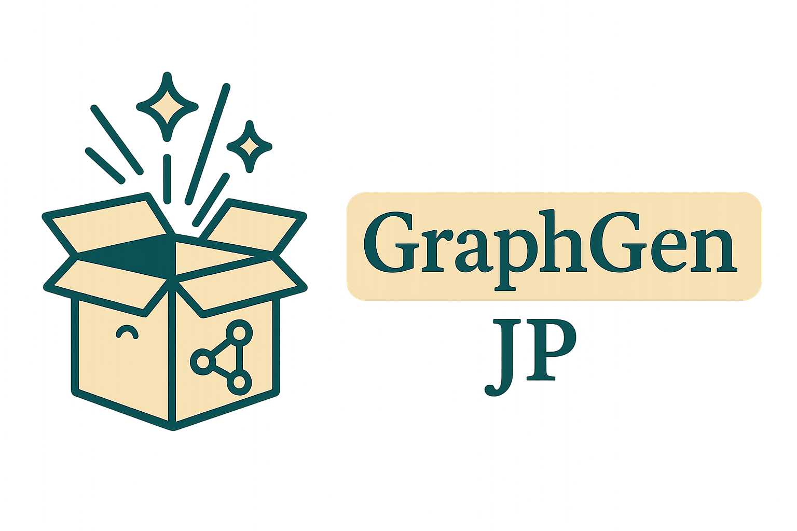

<div align="center">

[🇯🇵 日本語](README_ja.md) ｜ [🇬🇧 English](README.md)

</div>

<p align="center">
  
</p>

<!-- バッジ -->
[](https://github.com/open-sciencelab/GraphGen)
[](https://github.com/open-sciencelab/GraphGen)
[](https://github.com/open-sciencelab/GraphGen/issues)
[](https://github.com/open-sciencelab/GraphGen/issues)
[](https://graphgen-cookbook.readthedocs.io/en/latest/)
[](https://cdn.vansin.top/internlm/dou.jpg)
[](https://arxiv.org/abs/2505.20416)
[](https://huggingface.co/papers/2505.20416)
[](https://huggingface.co/spaces/chenzihong/GraphGen)
[](https://g-app-center-000704-6802-aerppvq.openxlab.space)

## 📝 GraphGenとは？

GraphGenは知識グラフに基づく合成データ生成フレームワークです。詳細は[論文](https://github.com/open-sciencelab/GraphGen/tree/main/resources/GraphGen.pdf)や[ベストプラクティス](https://github.com/open-sciencelab/GraphGen/issues/17)をご覧ください。

GraphGenは、ソーステキストから細粒度な知識グラフを構築し、期待キャリブレーション誤差指標を用いてLLMの知識ギャップを特定し、価値の高いロングテール知識に焦点を当てたQAペア生成を優先します。さらに、複雑な関係性を捉えるためのマルチホップ近傍サンプリングや、スタイル制御による多様なQAデータ生成も特徴です。

<details open>
<summary><b>📚 目次</b></summary>

- 📝 [GraphGenとは？](#-graphgenとは)
- 🚀 [クイックスタート](#-クイックスタート)
- 📌 [最新情報](#-最新情報)
- 🏗️ [システム構成](#-システム構成)
- 🍀 [謝辞](#-謝辞)
- 📚 [引用](#-引用)
- 📜 [ライセンス](#-ライセンス)

</details>

## 🚀 クイックスタート

[Webデモ](https://g-app-center-000704-6802-aerppvq.openxlab.space) または [バックアップWeb入口](https://openxlab.org.cn/apps/detail/tpoisonooo/GraphGen) から体験できます。

質問は[FAQ](https://github.com/open-sciencelab/GraphGen/issues/10)、[issue作成](https://github.com/open-sciencelab/GraphGen/issues)、または[WeChatグループ](https://cdn.vansin.top/internlm/dou.jpg)でどうぞ。

### 準備

1. [uv](https://docs.astral.sh/uv/reference/installer/)のインストール

    ```bash
    # ネットワーク問題がある場合はpipxやpipも利用可能。詳細はuv公式ドキュメント参照
    curl -LsSf https://astral.sh/uv/install.sh | sh
    ```

2. リポジトリのクローン

    ```bash
    git clone https://github.com/open-sciencelab/GraphGen
    cd GraphGen
    ```

3. 新しいuv環境の作成

    ```bash
    uv venv --python 3.10
    ```

4. 依存パッケージのインストール

    ```bash
    uv pip install -r requirements.txt
    ```

### Gradioデモの起動

```bash
uv run webui/app.py
```


### PyPIからの実行

1. GraphGenのインストール

    ```bash
    uv pip install graphg
    ```

2. CLIでの実行例

    ```bash
    SYNTHESIZER_MODEL=your_synthesizer_model_name \
    SYNTHESIZER_BASE_URL=your_base_url_for_synthesizer_model \
    SYNTHESIZER_API_KEY=your_api_key_for_synthesizer_model \
    TRAINEE_MODEL=your_trainee_model_name \
    TRAINEE_BASE_URL=your_base_url_for_trainee_model \
    TRAINEE_API_KEY=your_api_key_for_trainee_model \
    graphg --output_dir cache
    ```

### ソースからの実行

1. 環境変数の設定
    - ルートディレクトリに`.env`ファイルを作成

    ```bash
    cp .env.example .env
    ```

    - 以下の環境変数を設定

    ```bash
    # SynthesizerはKG構築・データ生成用モデル
    SYNTHESIZER_MODEL=your_synthesizer_model_name
    SYNTHESIZER_BASE_URL=your_base_url_for_synthesizer_model
    SYNTHESIZER_API_KEY=your_api_key_for_synthesizer_model
    # Traineeは生成データで学習するモデル
    TRAINEE_MODEL=your_trainee_model_name
    TRAINEE_BASE_URL=your_base_url_for_trainee_model
    TRAINEE_API_KEY=your_api_key_for_trainee_model
    ```

2. （任意）デフォルト設定を変更したい場合は`configs/graphgen_config.yaml`を編集

    ```yaml
    # configs/graphgen_config.yaml
    # 設定例
    data_type: "raw"
    input_file: "resources/examples/raw_demo.jsonl"
    # その他設定...
    ```

3. 生成スクリプトの実行

    ```bash
    bash scripts/generate.sh
    ```

4. 生成データの取得

    ```bash
    ls cache/data/graphgen
    ```

### Dockerでの実行

1. Dockerイメージのビルド

    ```bash
    docker build -t graphgen .
    ```

2. Dockerコンテナの起動

    ```bash
    docker run -p 7860:7860 graphgen
    ```

## 📌 最新情報

- **2025.04.21**: GraphGen初版リリース

## 🏗️ システム構成

GraphGenのシステム全体像やアーキテクチャ、主要機能については[deepwikiの分析](https://deepwiki.com/open-sciencelab/GraphGen)を参照してください。

### ワークフロー


## 🍀 謝辞

- [SiliconCloud](https://siliconflow.cn) 豊富なLLM API、一部モデルは無料
- [LightRAG](https://github.com/HKUDS/LightRAG) シンプルかつ効率的なグラフ検索ソリューション
- [ROGRAG](https://github.com/tpoisonooo/ROGRAG) ROGRAG: 頑健に最適化されたGraphRAGフレームワーク

## 📚 引用

本リポジトリが有用な場合は、以下の文献を引用してください。

```bibtex
@misc{chen2025graphgenenhancingsupervisedfinetuning,
      title={GraphGen: Enhancing Supervised Fine-Tuning for LLMs with Knowledge-Driven Synthetic Data Generation}, 
      author={Zihong Chen and Wanli Jiang and Jinzhe Li and Zhonghang Yuan and Huanjun Kong and Wanli Ouyang and Nanqing Dong},
      year={2025},
      eprint={2505.20416},
      archivePrefix={arXiv},
      primaryClass={cs.CL},
      url={https://arxiv.org/abs/2505.20416}, 
}
```

## 📜 ライセンス

本プロジェクトは[Apache License 2.0](LICENSE)の下で公開されています。
